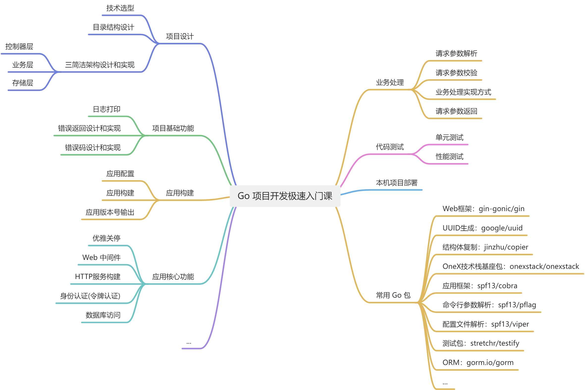

## fastgo 项目

- 云原生 AI 实战营项目之一，更多精彩项目见：[云原生 AI 实战营](https://konglingfei.com/)
- 该实战项目配套课程见： [Go 项目开发极速入门课](https://blog.csdn.net/lnxfei/category_12907774.html)
- 本初级项目的中级版本：[miniblog](https://github.com/onexstack/miniblog)

## fastgo 项目适宜人群

- 掌握一定 Go 基础语法，想通过一个完整的实战，来快速系统学习 Go 项目开发的初学者；
- 有意从事 Go 项目开发，但尚未入门或入门尚浅的同学。

## 项目快速部署

```bash
$ mkdir -p  $HOME/golang/src/github.com/onexstack/
$ cd $HOME/golang/src/github.com/onexstack/
$ git clone https://github.com/onexstack/fastgo
$ cd fastgo/
$ ./build.sh
$ _output/fg-apiserver -c configs/fg-apiserver.yaml
```

**注意：** 

1. 要登录 MySQL 并且执行 `source configs/fastgo.sql;` 创建 `fastgo` 数据库及表；
2. 更新 `configs/fg-apiserver.yaml` 中 `mysql` 配置项。

## fastgo 包含的技能点

技能点见下图所示：



